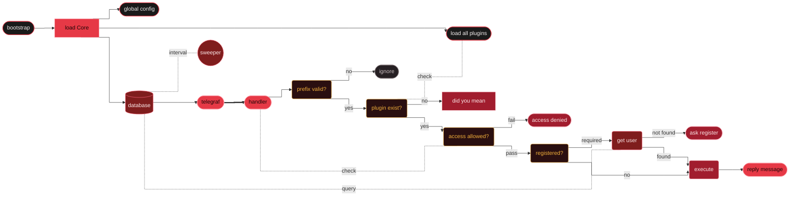

<!--
版权所有。允许个人和商业使用及修改。
重新分发请严格遵循 GPL-V3.0 协议，且请勿声称原创。

项目  :  Zero Two v0.0.1-alpha
作者  :  Velix
协议  :  GPL-V3.0
源码  :  github.com/vlxyzo/zerotwo
-->

<!-- header -->

  <h1><b>Zero Two</b></h1>
    
  A hyper aesthetic Telegram assistant. Maintained by <a href="https://github.com/vlxyzo">Velix</a>

---

<!-- badge -->

<!--

-->
  
  
  

---

<!-- caution n warn -->

> [!CAUTION]
> **ALPHA STAGE & OPEN SOURCE LICENSE (DISCLAIMER)**
>
> This project is currently in **Alpha Testing (`v0.0.1-alpha`)**. Expect bugs, unexpected crashes, and breaking changes.
>
> - **Commercial Use / Selling:** You are entirely free to modify, distribute, or sell this project. **HOWEVER**, under the GPL-3.0 rules, any modified or distributed versions _must_ remain open-source and be licensed under the exact same GPL-3.0 license.
> - **Zero Liability:** The [author](https://github.com/vlxyzo) and maintainers assume **no liability or responsibility** for any account bans, data loss, API downtime, or damages resulting from the use of this software. **USE AT YOUR OWN RISK.**

> [!WARNING]
> **EXTERNAL API RELIANCE & TELEGRAM RISKS**
>
> 1. **Third-Party Endpoints:** This project heavily relies on external web APIs for its core features. If the target API is down, rate-limited, or changes its response structure, the bot _will_ break or throw errors.
> 2. **Unhandled Alpha Bugs:** Because this is an early alpha release, error handling for external API timeouts or invalid JSON responses might not be fully polished yet. Expect the bot to crash if an endpoint acts up.
> 3. **FloodWait & Rate Limits:** Telegram has strict API rate limits. Spamming commands, sending excessive messages, or ignoring `retry-after` headers will trigger `FloodWait` errors or temporary server IP bans.
> 4. **Spam & User Reports:** Using this bot for unsolicited mass broadcasting will lead to user reports. Telegram's anti-spam system will permanently ban bots (and potentially associated accounts) if flagged for abuse.
> 5. **Userbot Risks (If applicable):** If you run this as a Userbot (logging in with a user phone number via MTProto instead of a BotFather token), the risk of a permanent account ban is significantly higher. Avoid automating high-frequency user actions.

---

<!--- flowchart -->

  <h1><b>Flow Diagram</b></h1>

---

<!-- key features -->

  <h1><b>Key Features</b></h1>

<table align="center" width="100%">
  <tr>
    <td align="center" width="33%">
      <b>ELITE PERFORMANCE</b>  
        
      Strict TS 5+ Native ESModules
    </td>
    <td align="center" width="33%">
      <b>AI SUPPORT</b>  
        
      Smart Conversational Automated Workflows
    </td>
    <td align="center" width="33%">
      <b>ROBUST STORAGE</b>  
        
      Supabase Database Persistent State
    </td>
    </tr><tr>
    <td align="center" width="33%">
      <b>MODULAR ARCH</b>  
        
      Plug-and-Play Plugins Clean and Maintainable
    </td>
    <td align="center" width="33%">
      <b>OMNI FETCH</b>  
        
      HD Media Downloader Fast Async Pipeline
    </td>
    <td align="center" width="33%">
      <b>OWNER TOOLS</b>  
        
      Eval and Shell Commands Full Owner Control
    </td>
  </tr>
</table>

---

<!-- requirements -->

  <h1><b>Requirements</b></h1>

<table align="center" width="100%">
  <thead>
    <tr>
      <th align="center" width="30%">Dependency</th>
      <th align="center" width="20%">Version</th>
      <th align="center" width="50%">Details</th>
    </tr>
  </thead>
  <tbody>
    <tr>
      <td align="center"><b>Node.js</b></td>
      <td align="center"><code>&gt;=24.0.0</code></td>
      <td align="center">Core runtime (uses native <code>--env-file</code>)</td>
    </tr><tr>
      <td align="center"><b>npm</b></td>
      <td align="center"><code>&gt;=11.0.0</code></td>
      <td align="center">Default package manager</td>
    </tr><tr>
      <td align="center"><b>TypeScript</b></td>
      <td align="center"><code>^7.0.2</code></td>
      <td align="center">Core programming language</td>
    </tr><tr>
      <td align="center"><b>tsx</b></td>
      <td align="center"><code>^4.23.13</code></td>
      <td align="center">TypeScript execution engine for Node.js</td>
    </tr><tr>
      <td align="center"><b>Git</b></td>
      <td align="center">Any</td>
      <td align="center">Version control and repository updates</td>
    </tr><tr>
      <td align="center"><b>FFmpeg</b></td>
      <td align="center">Any</td>
      <td align="center">Required for media processing</td>
    </tr><tr>
      <td align="center"><b>PM2</b></td>
      <td align="center">Any</td>
      <td align="center">Optional for 24/7 process management</td>
    </tr>
  </tbody>
</table>

---

<!-- filler -->

---

<!-- docs -->

  <h1><b>Explore Docs</b></h1>

<table width="100%">
  <tr>
    <td width="50%" valign="top">
      <b><a href="./docs/custom_l.md">Customization</a></b>
       Change prefixes, names, and core bot behaviors
    </td>
    <td width="50%" valign="top">
      <b><a href="./docs/install_l.md">Installation</a></b>
       Deep-dive setup guide and error troubleshooting
    </td>
  </tr><tr>
    <td width="50%" valign="top">
      <b><a href="./docs/deploy_l.md">Deployment</a></b>
       Advanced steps for VPS, Heroku, and Pterodactyl
    </td>
    <td width="50%" valign="top">
      <b><a href="./docs/path_l.md">Project Structure</a></b>
       A full map of the codebase and directories
    </td
  </tr><tr>
    <td colspan="2" align="center">
      <b><a href="./docs/REPORT.md">Bug Report</a></b>
       Found a glitch? Help me improve by reporting it here
    </td>
  </tr>
</table>
